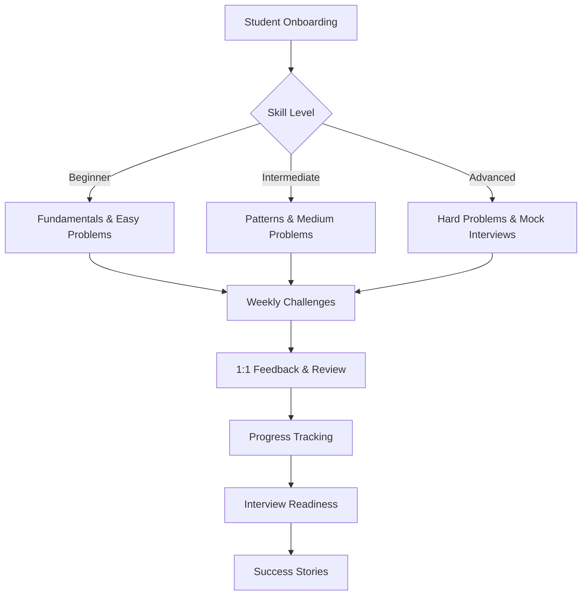

# 🚀 **Mentoring Excellence: LeetCode Problem Solving & Growth**

---

## 🌟 Introduction

Welcome to a unique repository chronicling my journey as a programming mentor, where I guided 75+ students through the world of LeetCode and technical interview preparation. This collection is more than a set of solutions—it's a living archive of strategies, breakthroughs, and the real impact of one-on-one mentorship in algorithmic thinking and coding confidence.

---

## 📈 Impact Highlights

| Metric                | Value         |
|-----------------------|--------------|
| 👩‍💻 Students Mentored | 75+          |
| ⏳ Hours Invested      | 250+         |
| 🏅 Success Stories    | Dozens landed internships, aced interviews, and built lasting problem-solving habits |

---

## 📦 Repository Contents

- 🗂️ **LeetCode Solutions:** Clean, well-explained code for a wide range of LeetCode problems (Easy, Medium, Hard).
- 📖 **Problem Walkthroughs:** In-depth explanations, edge case analysis, and annotated code.
- 🧩 **Interview Prep Guides:** Patterns, cheat sheets, and step-by-step approaches for common interview topics.
- 📝 **Mentoring Notes:** Personalized feedback, session recaps, and progress logs.
- 📊 **Progress Visualizations:** Charts and diagrams tracking student milestones and topic mastery.

---

## 🧑‍🏫 Mentoring Philosophy

I believe in unlocking each student’s unique potential by demystifying algorithms and making problem-solving approachable. My approach blends technical rigor with empathy—breaking down complex challenges, encouraging curiosity, and building the confidence to tackle any coding interview.

---

## 🛠️ Technologies & Topics Covered

- **Languages:** Python, Java, JavaScript
- **LeetCode Topics:** Arrays, Strings, Linked Lists, Trees, Graphs, Dynamic Programming, Backtracking, Binary Search, Sliding Window, Two Pointers, Heaps, Stacks & Queues
- **Techniques:** Time/Space Complexity Analysis, Recursion, Memoization, Greedy Algorithms, Interview Simulation

---

## 📊 Visual Progress & Learning Flow

---

## 🚀 Getting Started

- **Browse Solutions:** Dive into the `/solutions` directory for categorized LeetCode problems and detailed explanations.
- **Mentoring Materials:** Find interview prep guides and session notes in the `resources/` folder.
- **Visualize Progress:** Use the Mermaid diagram above to understand the mentoring journey and learning flow.
- **For Learners:** Leverage the explanations and guides to strengthen your problem-solving and interview skills.
- **For Mentors:** Adapt the resources and structure for your own teaching or study groups.

---

## 📝 License

This repository is licensed under the MIT License.

---

## 🙏 Acknowledgements

- To every student who brought determination and curiosity to each session—your growth is the true measure of this work.
- Thanks to LeetCode for providing a world-class platform for algorithmic mastery.
- Appreciation to fellow mentors and the broader coding community for inspiration and support.

---

## 🏅 Badges

---

## 📚 Table of Contents

- [Introduction](#introduction)
- [Impact Highlights](#impact-highlights)
- [Repository Contents](#repository-contents)
- [Mentoring Philosophy](#mentoring-philosophy)
- [Technologies & Topics Covered](#technologies--topics-covered)
- [Visual Progress & Learning Flow](#visual-progress--learning-flow)
- [Getting Started](#getting-started)
- [License](#license)
- [Acknowledgements](#acknowledgements)
- [Badges](#badges)

---

Thank you for exploring this repository—where mentorship meets mastery, and every solution is a step toward real-world success.
