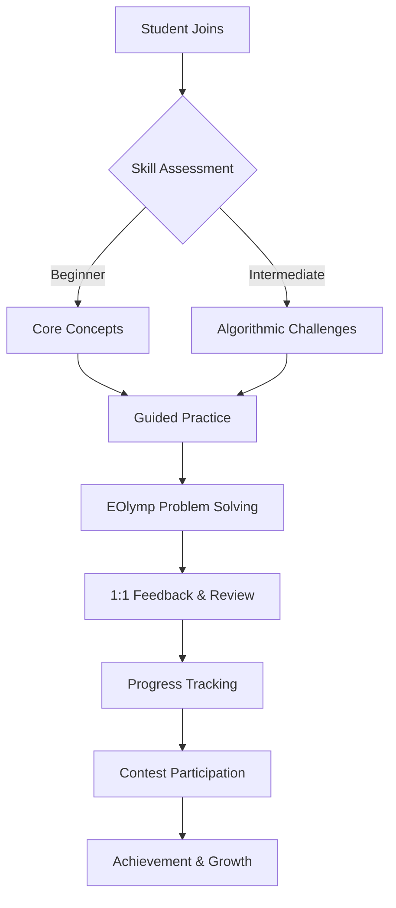

# 🌟 **Mentoring 75+ Programmers: EOlymp Competitive Coding Journey**

---

## 📖 Introduction

Welcome to a repository that captures the real-world impact of hands-on programming mentorship. Here, you’ll find the resources, solutions, and strategies I developed while guiding over 75 students—each with unique backgrounds—through the challenges of algorithmic and competitive programming on EOlymp. This collection is more than just code; it’s a record of growth, resilience, and the art of thinking like a true problem solver.

---

## 📊 Impact at a Glance

| Metric                | Value         |
|-----------------------|--------------|
| 👨‍🎓 Students Mentored | 75+          |
| ⏰ Hours of Guidance   | 200+         |
| 🏆 Success Stories    | 20+ students reached top EOlymp rankings, dozens completed their first contests, and many unlocked new confidence in coding |

---

## 📦 Features & Contents

- 📝 **EOlymp Problem Solutions:** Clean, well-commented code for a wide range of algorithmic challenges.
- 📚 **Problem Explanations:** Step-by-step breakdowns and annotated solutions.
- 🧠 **Algorithm Notes:** Key concepts, patterns, and competitive programming techniques.
- 💡 **Mentoring Materials:** Slides, cheat sheets, and session notes from live mentoring.
- 📈 **Progress Trackers:** Visual charts and diagrams showing student achievements and learning flow.

---

## 🧭 Mentoring Approach

My mentoring philosophy centers on empowering students to think beyond syntax—cultivating analytical reasoning, creative problem-solving, and the confidence to tackle the unknown. I believe in meeting each learner where they are, breaking down complex ideas into approachable steps, and celebrating every milestone along the way.

---

## 🛠️ Technologies & Topics Covered

- **Languages:** Java, Python, C++
- **Algorithms:** Sorting, searching, dynamic programming, greedy algorithms, graph theory, recursion, data structures (arrays, stacks, queues, trees, maps)
- **Techniques:** Problem decomposition, time/space complexity analysis, test-driven development, competitive coding strategies

---

## 🖼️ Visual Learning Flow

---

## 🚀 Getting Started

- **Browse Solutions:** Explore the `/src` directory for EOlymp problem solutions and explanations.
- **Mentoring Materials:** Check the `resources/` folder for slides, notes, and cheat sheets.
- **Learning Path:** Follow the Mermaid diagram above to see how students progressed through the course.
- **For Learners:** Use the explanations and notes to deepen your understanding and practice new problems.
- **For Mentors:** Adapt the materials and flow for your own teaching or study groups.

---

## 📝 License

  
This repository is licensed under the MIT License.

---

## 🙏 Acknowledgements

- To every student who brought curiosity and determination to each session—your progress is the heart of this project.
- Special thanks to EOlymp for providing a challenging and accessible platform for algorithmic growth.
- Gratitude to the course organizers and fellow mentors for their support and collaboration.

---

## 🏅 Badges

---

## 📚 Table of Contents

- [Introduction](#introduction)
- [Impact at a Glance](#impact-at-a-glance)
- [Features & Contents](#features--contents)
- [Mentoring Approach](#mentoring-approach)
- [Technologies & Topics Covered](#technologies--topics-covered)
- [Visual Learning Flow](#visual-learning-flow)
- [Getting Started](#getting-started)
- [License](#license)
- [Acknowledgements](#acknowledgements)
- [Badges](#badges)

---

Thank you for visiting this repository—where code meets mentorship, and every solution tells a story of growth.
